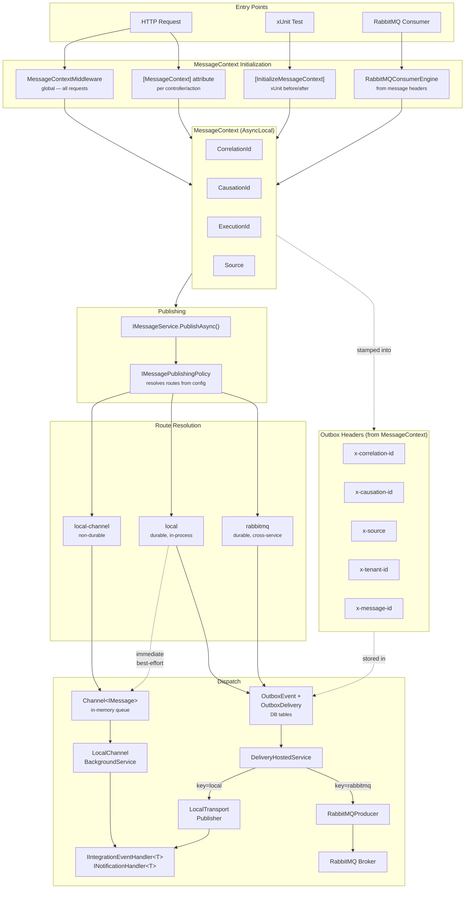

+++
title = "Messaging"
date = "2026-02-19"
weight = 6
chapter = true
+++

Juice v9 unifies all message types under a single `IMessage` hierarchy and introduces a
`MessagingBuilder` entry point that composes the outbox, delivery, idempotency, and
broker layers with a single `services.AddMessaging()` call.

## IMessage Hierarchy

Every message type in Juice v9 — MediatR commands, domain events, and integration events —
implements `IMessage`, giving them a shared identity (`MessageId`, `CreatedAt`, `TenantId`).

```
IMessage
├── MessageId : Guid
├── CreatedAt : DateTimeOffset
└── TenantId  : string?

IEvent : IMessage
└── EventName : string

IIntegrationEvent : IEvent          ← required only on the CONSUMING side
└── (marker — enables dispatcher routing)

MessageBase (abstract record) : IMessage
└── MessageId = Guid.NewGuid(), CreatedAt = UtcNow (defaults)

IntegrationEvent (abstract record) : MessageBase, IIntegrationEvent
└── EventName → GetType().Name (default)    ← optional to customizing the routing key on the PRODUCER side
```

### Publish vs. Consume roles

| Role | Type required | Reason |
|---|---|---|
| **Publishing** (outbox staging) | Any `IMessage` | Outbox accepts any message including plain domain events |
| **Consuming** (broker dispatch) | Must implement `IIntegrationEvent` | `IntegrationEventDispatcher` uses `EventName` + type registry to deserialize and route from raw bytes |

> **Key insight**: A plain domain event (`IMessage`) can be published and delivered through
> the outbox without ever implementing `IIntegrationEvent` if you do not want to customizing the event name.
> Only services that need to *receive* it via broker infrastructure must use `IIntegrationEvent`.

---

## Setup Guides

Choose the guide that matches your service's needs. Each is independently followable.

| Guide | What it sets up |
|---|---|
| [MessageContext]() | `MessageContext` initialization via middleware, `[MessageContext]` attribute, or `[InitializeMessageContext]` for tests |
| [Mediator]() | MediatR Request/Response, Notification, and Stream Request patterns with handler implementation |
| [Outbox Setup]() | Transactional staging of any `IMessage` inside a MediatR `TransactionBehavior` |
| [Delivery Setup]() | Background `DeliveryHostedService` that forwards staged messages to the broker |
| [Local Transport]() | In-process dispatch via `IMessageService` — `"local-channel"` (non-durable) and `"local"` (outbox-backed) routes with immediate dispatch and idempotency deduplication |
| [Consumption Setup]() | RabbitMQ consumer engine, `IIntegrationEventHandler<T>` dispatch, and automatic idempotency |
| [Full Setup]() | All sub-builders combined in one `AddMessaging()` call, with migration table |

---

## How It All Fits Together

The diagram below shows how a message flows from an HTTP request through the messaging
pipeline to its final destination — in-process handler or broker.



> **Key concept**: `MessageContext` is initialized once at the entry point, flows through
> all async operations via `AsyncLocal`, and is stamped into outbox headers. When a message
> crosses a service boundary (via broker) or is retried (via `LocalTransportPublisher`),
> `MessageContext` is **restored from these headers** — preserving correlation across the
> entire chain.

---

## Internal Messaging Setup

Use this setup when your service only needs in-process MediatR command deduplication —
no external broker, no outbox table, no delivery worker.

### When to use

- Service handles `IIdempotentRequest` commands from an HTTP API or message queue handler
- No need to publish events to other services from this registration
- You want idempotent command handling without any infrastructure dependencies

### Prerequisites

None. This is the simplest, self-contained setup.

### NuGet packages

| Package | Purpose |
|---|---|
| [Juice.Messaging](https://www.nuget.org/packages/Juice.Messaging) | `MessagingBuilder` entry point, `IMessage` hierarchy |
| [Juice.MediatR.Behaviors](https://www.nuget.org/packages/Juice.MediatR.Behaviors) | `IdempotencyRequestBehavior<,>`, `TransactionBehavior<,,>` |
| [Juice.MediatR.Contracts](https://www.nuget.org/packages/Juice.MediatR.Contracts) | `IIdempotentRequest` interface |
| [Juice.Messaging.Idempotency.Redis](https://www.nuget.org/packages/Juice.Messaging.Idempotency.Redis) | Redis idempotency backend (recommended for production) |
| [Juice.Messaging.Idempotency.Caching](https://www.nuget.org/packages/Juice.Messaging.Idempotency.Caching) | In-memory or distributed cache backend |
| [Juice.Messaging.Idempotency.EF](https://www.nuget.org/packages/Juice.Messaging.Idempotency.EF) | EF idempotency backend (auditable / SQL-required) |

### DI Registration

```csharp {linenos=false,hl_lines=[3,8,9],linenostart=1}
services.AddMessaging(builder =>
{
    builder.AddIdempotencyRedis(opts =>
    {
        opts.Configuration = configuration.GetConnectionString("Redis");
    });
});

services.AddMediatR(cfg =>
{
    cfg.RegisterServicesFromAssembly(typeof(MyHandler).Assembly);
    cfg.AddIdempotencyRequestBehavior();
});
```

---

### IIdempotentRequest (replaces IRequestManager)

`IIdempotentRequest` is the v9 replacement for the v8.5.0 `IRequestManager` + `IIdentifiedCommand<T>` pattern.
Mark your command with `IIdempotentRequest` and the `IdempotencyBehavior` handles deduplication automatically.

```csharp {linenos=false,hl_lines=[1,5],linenostart=1}
// In Juice.MediatR.Contracts (package: Juice.MediatR.Contracts)
public interface IIdempotentRequest : IBaseRequest
{
    // Caller-supplied unique key — generated by the sender, not the server
    string IdempotencyKey { get; }
}
```

**Usage example — mark your command directly:**

```csharp {linenos=false,hl_lines=[1,6],linenostart=1}
public record CreateOrderCommand(string OrderId, string CustomerId)
    : IRequest<IOperationResult>, IIdempotentRequest
{
    // IdempotencyKey is the caller-supplied unique identifier
    // The framework calls IIdempotencyService automatically — no handler changes needed
    public string IdempotencyKey => OrderId;
}
```

**v8.5.0 → v9 comparison:**

| v8.5.0 | v9 |
|---|---|
| Wrap command: `new IdentifiedCommand<T>(cmd, id)` | Mark command directly with `IIdempotentRequest` |
| Inject `IRequestManager` into handler | No injection needed |
| Call `requestManager.ExistAsync(id)` manually | `IdempotencyBehavior` calls `IIdempotencyService` automatically |
| Register `IIdentifiedCommand<T>` handler | Register your command handler directly |

---

### IdempotencyBehavior Pipeline

`IdempotencyRequestBehavior<TRequest, TResponse>` intercepts any `IRequest<T>` that also
implements `IIdempotentRequest`. It runs at pipeline order `int.MinValue` — before all
other behaviors — so duplicate commands are rejected before any handler logic executes.

**How it works:**

1. Behavior checks `IIdempotencyService.TryCreateRequestAsync(key, typeName)`
2. If the key already exists → returns the cached result immediately (no handler invoked)
3. If the key is new → proceeds through the pipeline, then stores the result

> **Shared registration**: One `IIdempotencyService` registration serves both
> `IdempotencyBehavior` (MediatR pipeline) and `IntegrationEventDispatcher` (consumer side).
> No separate registration is needed for each.

---

### Idempotency Backend Selection

| Backend | Registration | Package | Use case |
|---|---|---|---|
| In-memory | `builder.AddIdempotencyInMemory()` | `Juice.Messaging.Idempotency.Caching` | Tests and development only |
| Distributed cache | `builder.AddIdempotencyDistributedCache()` | `Juice.Messaging.Idempotency.Caching` | Simple, non-critical workloads |
| **Redis** | `builder.AddIdempotencyRedis(opts => { ... })` | `Juice.Messaging.Idempotency.Redis` | **Production (recommended)** |
| EF | `builder.AddIdempotencyEF(config, opts => { ... })` | `Juice.Messaging.Idempotency.EF` | Auditable / SQL Server required |

---

## See also

- [MessageContext]() — middleware, attribute, and test initialization
- [Mediator]() — Request/Response, Notification, and Stream Request patterns
- [Outbox Setup]() — add transactional message staging
- [Local Transport]() — in-process dispatch with `IMessageService`
- [Full Setup]() — combine all sub-builders + migration table
- [MediatR v8.5.0 archive]() — original `IRequestManager` documentation
- [Event bus v8.5.0 archive]() — original `IEventBus` documentation
