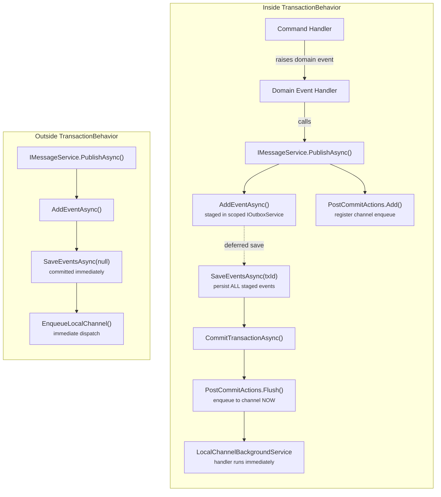

## Overview

The Local Transport adds two in-process delivery routes and a unified `IMessageService`
publishing interface. Messages can be dispatched to handlers within the same process
without requiring a broker, while still supporting configuration-driven routing that can
switch between local and broker delivery with no code changes.

| Route | Publisher Key | Durable? | Latency | Use case |
|---|---|---|---|---|
| **In-memory channel** | `"local-channel"` | No | Immediate | Fast fire-and-forget: cache invalidation, lightweight side-effects |
| **Outbox + in-process** | `"local"` | Yes | Near-immediate | Reliable cross-aggregate events within the same service |
| **Outbox + broker** | `"rabbitmq"` | Yes | Polling interval | Cross-service messaging (existing) |

> **`"local-channel"` and `"local"` are mutually exclusive.** If a publishing policy
> resolves both routes for the same event, `"local"` takes precedence — it is the durable
> superset (outbox write + immediate in-process dispatch). The `"local-channel"` route is
> ignored to prevent double handler invocation. Use one or the other per event type.

---

## When to use

- You need in-process event dispatch without broker overhead (`"local-channel"`)
- You need durable, retryable in-process dispatch backed by the outbox (`"local"`)
- You want a single `PublishAsync` call site where routing is config-driven
- You are building a monolith or modular monolith where some events stay in-process

---

## Prerequisites

- [Internal Messaging Setup]() for `IIdempotencyService` and `MessagingBuilder`
- [Outbox Setup]() if using the `"local"` durable route

---

## NuGet packages

| Package | Purpose |
|---|---|
| [Juice.Messaging.Local](https://www.nuget.org/packages/Juice.Messaging.Local) | `IMessageService`, `LocalChannelBackgroundService`, `LocalTransportPublisher` |
| [Juice.Messaging](https://www.nuget.org/packages/Juice.Messaging) | `MessagingBuilder`, `IMessagePublishingPolicy`, `IOutboxService<T>` |
| [Juice.Messaging.Outbox.EF](https://www.nuget.org/packages/Juice.Messaging.Outbox.EF) | `DefaultOutboxContext`, `AddDefaultMessageService()`, EF-backed outbox repository |
| [Juice.Messaging.Idempotency.Caching](https://www.nuget.org/packages/Juice.Messaging.Idempotency.Caching) | In-memory idempotency (dev/test) |
| [Juice.Messaging.Idempotency.Redis](https://www.nuget.org/packages/Juice.Messaging.Idempotency.Redis) | Redis idempotency (production) |

---

## IMessageService — Unified Publishing Interface

Two interfaces are available, each with its own registration path:

| Interface | Registration | Routes supported | When to use |
|---|---|---|---|
| `IMessageService` | `AddDefaultMessageService()` | All three | Application services, controllers, background jobs — outside domain transactions |
| `IMessageService<TContext>` | `AddMessageService<TContext>()` | All three | Inside `TransactionBehavior` — defers outbox save until after commit |

Both expose a single method:

```csharp
Task PublishAsync(IMessage message, CancellationToken cancellationToken = default);
```

The same `PublishAsync` call works for domain events (`INotification`) and integration
events (`IIntegrationEvent`). Routing is resolved by `IMessagePublishingPolicy` at
runtime — changing the route in configuration changes the transport with no code changes.

---

## DI Registration

### Local-channel only (zero DB)

`AddLocalChannel()` registers the channel, background service, and `IMessagePublisher`
keyed `"local-channel"` — but **not** `IMessageService`. Use `AddDefaultMessageService()`
to register `IMessageService`. When all routes resolve to `"local-channel"`, the
`DefaultOutboxContext` is never accessed, so the configure delegate can be a no-op.

```csharp {linenos=false,hl_lines=[3,6],linenostart=1}
services.AddMessaging(builder =>
{
    builder.AddLocalChannel(opts =>
    {
        opts.MaxConcurrency = 10;   // optional: limit concurrent handlers (default: unlimited)
        opts.Capacity = 10_000;     // optional: bounded channel (default: unbounded)
    });
    builder.AddIdempotencyInMemory();  // or AddIdempotencyRedis for production

    // Registers IMessageService; DefaultOutboxContext is never accessed
    // when all routes resolve to "local-channel"
    builder.AddDefaultMessageService(_ => { });
});

// Register publishing policy
services.AddSingleton<IMessagePublishingPolicy>(
    new FixedRoutePolicy("local-channel", string.Empty));
// or use config-driven policies:
// builder.AddPublishingPolicies(configuration.GetSection("PublishingPolicies"));
```

### All routes (local-channel + local + broker)

```csharp {linenos=false,hl_lines=[3,4,5],linenostart=1}
services.AddMessaging(builder =>
{
    builder.AddPublishingPolicies(configuration.GetSection("PublishingPolicies"));

    builder.AddOutbox(outbox =>
    {
        outbox.AddOutboxRepository();
        outbox.AddDeliveryIntents();
    });

    // Registers IMessageService<AppDbContext> (implies AddLocalChannel)
    builder.AddMessageService<AppDbContext>();

    // Registers LocalTransportPublisher as keyed ITransportPublisher "local".
    // No type parameter — publisher is context-independent.
    builder.AddLocalPublisher();

    builder.AddIdempotencyRedis(opts =>
    {
        opts.Configuration = configuration.GetConnectionString("Redis");
    });

    // Delivery worker for outbox-backed routes.
    // Each AddDeliveryProcessor call is independent — both are required even when
    // TContext is the same. Omitting the "local" call means outbox rows are written
    // but never picked up (State stays NotPublished indefinitely).
    builder.AddDelivery(delivery =>
    {
        // "local" publisher key dispatches in-process via LocalTransportPublisher
        delivery.AddDeliveryProcessor<AppDbContext>("local",
            "send-pending", "retry-failed", "recover-timeout");

        // "rabbitmq" publisher key dispatches to broker (existing)
        delivery.AddDeliveryProcessor<AppDbContext>("rabbitmq",
            "send-pending", "retry-failed", "recover-timeout");

        delivery.AddDeliveryPolicies(configuration.GetSection("DeliveryPolicies"));
    });
});
```

> **`INotification` dispatch requires `AddMediatR()`**: when `LocalTransportPublisher`
> delivers a message that implements `INotification`, it resolves `IMediator` from the
> DI scope. If `services.AddMediatR()` was not called, delivery will throw
> `InvalidOperationException` at runtime. `IIntegrationEvent` messages are dispatched
> via `IntegrationEventDispatcher` and do **not** require `IMediator`.

### Full-route outside transactions (`DefaultOutboxContext`)

Use `AddDefaultMessageService()` when you need full-route publishing (`"local-channel"`,
`"local"`, and broker routes) from code that runs **outside** a `TransactionBehavior`
pipeline — for example, API controllers, background services, or application-layer services
that are not part of a domain transaction.

```csharp {linenos=false,hl_lines=[4],linenostart=1}
services.AddMessaging(builder =>
{
    // Registers DefaultOutboxContext + IMessageService (backed by MessageService<DefaultOutboxContext>)
    builder.AddDefaultMessageService(opts =>
        opts.UseSqlServer(configuration.GetConnectionString("Outbox")));

    builder.AddLocalChannel();          // required for "local-channel" route dispatch
    builder.AddIdempotencyRedis(opts =>
        opts.Configuration = configuration.GetConnectionString("Redis"));

    builder.AddPublishingPolicies(configuration.GetSection("PublishingPolicies"));
});
```

> **Delivery is not auto-configured.** If you use the `"local"` or broker routes, add the
> delivery worker explicitly:
>
> ```csharp
> builder.AddDelivery(delivery =>
> {
>     delivery.AddDeliveryProcessor<DefaultOutboxContext>("local",
>         "send-pending", "retry-failed", "recover-timeout");
> });
> ```

> **`IMessageService` registration uses `TryAddScoped` — first call wins.** Do not call
> both `AddMessageService<TContext>()` and `AddDefaultMessageService()` in the same
> container. Use `IMessageService<TContext>` if you need domain-transaction deferral inside
> `TransactionBehavior`; use `AddDefaultMessageService()` for everything else.

---

## DefaultOutboxContext

`DefaultOutboxContext` is a standalone EF Core `DbContext` implementing `IOutboxContext`.
It owns its own database connection string and is completely independent of any domain
`DbContext` registered in the application.

### Schema

`DefaultOutboxContext` uses the **same tables** (`OutboxEvents` and `OutboxDeliveries`)
as `OutboxContext`. The schema is applied via the shared `ConfigureOutbox()` extension —
no separate migration project is needed.

> **To create the tables**: run the existing `OutboxContext` migrations against the target
> database. `DefaultOutboxContext` resolves the schema from those migrations automatically.

### Transaction behavior (`IsManaged = false`)

`DefaultOutboxContext.IsManaged` is always `false`. This means `SaveEventsAsync` is
**never deferred** — it executes immediately as a standalone operation, regardless of
whether a domain transaction is in progress elsewhere in the application.

This is intentional: `DefaultOutboxContext` is designed for code paths that are **outside**
a `TransactionBehavior` pipeline. For code inside `TransactionBehavior` — where you need
outbox saves to be deferred until the domain transaction commits — use
`IMessageService<TContext>` with your domain `DbContext` instead.

### Isolation from `OutboxContext`

If you also register `OutboxContext` (e.g., for broker delivery driven by `AppDbContext`),
the two contexts are registered as separate EF services with separate connection strings.
They do not collide in DI — one is `IOutboxContext` for `OutboxContext`, the other for
`DefaultOutboxContext`. Both can coexist and even target the same database if desired.

---

## Coexistence — `IMessageService` and `IMessageService<TContext>`

Both registrations can coexist in the same application without conflict:

```csharp {linenos=false,linenostart=1}
services.AddMessaging(builder =>
{
    // Domain-aware: used inside TransactionBehavior (defers outbox save until commit)
    builder.AddMessageService<AppDbContext>();

    // Default outbox: used outside transactions (saves immediately)
    builder.AddDefaultMessageService(opts =>
        opts.UseSqlServer(configuration.GetConnectionString("Outbox")));
});
```

`IMessageService` (backed by `DefaultOutboxContext`) and `IMessageService<AppDbContext>`
resolve as independent instances — they write to separate outbox scopes and do not interfere.

### When to inject which

| Injection context | Interface to inject | Why |
|---|---|---|
| Command handler inside `TransactionBehavior` | `IMessageService<TContext>` | Defers `SaveEventsAsync` until after domain transaction commits |
| Domain event handler inside `TransactionBehavior` | `IMessageService<TContext>` | Must participate in the same transaction scope |
| API controller | `IMessageService` | No transaction context; saves immediately via `DefaultOutboxContext` |
| Background service / `IHostedService` | `IMessageService` | No transaction context; saves immediately |
| Application service (non-transactional) | `IMessageService` | Simpler; no domain `DbContext` dependency |

> **`IMessageService` is registered with `TryAddScoped` — first call wins.** If both
> `AddMessageService<TContext>()` and `AddDefaultMessageService()` are called,
> only the first `IMessageService` registration is active. `IMessageService<TContext>` (the
> generic form) is **always registered independently** and does not conflict with
> `IMessageService`.

---

## Publishing Policy Configuration

Route events to local or broker transports via `appsettings.json`:

```json {linenos=false,linenostart=1}
{
    "PublishingPolicies": {
        "Default": {
            "Publishers": [
                { "Key": "rabbitmq", "Destination": "default_exchange" }
            ]
        },
        "Rules": [
            {
                "Priority": 1000,
                "Match": { "Domain": "Cache" },
                "Publishers": [
                    { "Key": "local-channel", "Destination": "" }
                ]
            },
            {
                "Priority": 900,
                "Match": { "Domain": "Workflows" },
                "Publishers": [
                    { "Key": "local", "Destination": "" }
                ]
            },
            {
                "Priority": 800,
                "Match": { "Domain": "Orders" },
                "Publishers": [
                    { "Key": "local", "Destination": "" },
                    { "Key": "rabbitmq", "Destination": "orders_exchange" }
                ]
            }
        ]
    }
}
```

In this example:
- **Cache** domain events use `"local-channel"` (instant, non-durable)
- **Workflows** domain events use `"local"` (durable, in-process)
- **Orders** events go to **both** `"local"` and `"rabbitmq"` (local handler + cross-service broker)

> **Do not combine `"local-channel"` and `"local"`** in the same rule — `"local"` will
> supersede `"local-channel"`, making the `"local-channel"` entry redundant. Use `"local"`
> when you need durability, or `"local-channel"` when you explicitly want zero DB overhead.

---

## Usage Example

```csharp {linenos=false,hl_lines=[5,12],linenostart=1}
public class OrderCommandHandler : IRequestHandler<CreateOrderCommand, IOperationResult>
{
    private readonly AppDbContext _db;
    private readonly IMessageService<AppDbContext> _messaging;

    public OrderCommandHandler(AppDbContext db, IMessageService<AppDbContext> messaging)
    {
        _db = db;
        _messaging = messaging;
    }

    public async Task<IOperationResult> Handle(CreateOrderCommand cmd, CancellationToken ct)
    {
        var order = new Order(cmd.OrderId, cmd.CustomerId);
        _db.Orders.Add(order);

        // Routing determined by IMessagePublishingPolicy config — no transport knowledge here
        await _messaging.PublishAsync(new OrderCreatedEvent(order.Id), ct);

        return OperationResult.Success();
    }
}
```

---

## Route Behavior Details

### `"local-channel"` — Non-Durable, Immediate

1. Message enqueued to `Channel<IMessage>` (singleton; unbounded by default, configurable via `LocalChannelOptions.Capacity`)
2. `PublishAsync` returns **immediately** — handler runs asynchronously
3. `LocalChannelBackgroundService` drains the channel and dispatches:
   - `INotification` → full MediatR notification pipeline (`INotificationPublisher.Publish<T>`)
   - `IIntegrationEvent` → `IntegrationEventDispatcher` → all `IIntegrationEventHandler<T>` in DI
4. Handler exceptions are caught and logged — they do not crash the service
5. Concurrency bounded by `MaxConcurrency` option (default: unlimited)
6. **Not durable**: messages in the channel are lost on process shutdown

### `"local"` — Durable, Near-Immediate

**Outside `TransactionBehavior`** (standalone publish):

1. Message staged via `AddEventAsync`, then saved via `SaveEventsAsync(null)` (standalone commit)
2. After outbox commit, message is **also enqueued to the channel** for immediate best-effort dispatch
3. `LocalChannelBackgroundService` dispatches the handler
4. `IntegrationEventDispatcher` records the idempotency key on successful dispatch
5. `DeliveryHostedService` later processes the same outbox record via `LocalTransportPublisher`
6. Idempotency check detects the duplicate → handler is **not invoked again**
7. If immediate dispatch fails, the outbox record remains `NotPublished` — delivery retries as normal

> **`DefaultOutboxContext` users**: delivery is not auto-configured. Register
> `AddDeliveryProcessor<DefaultOutboxContext>("local", ...)` explicitly (see
> [Full-route outside transactions](#full-route-outside-transactions-defaultoutboxcontext)).

**Inside `TransactionBehavior`** (domain event handler):

1. Message staged via `AddEventAsync` — save is **deferred**
2. Channel enqueue registered as a **post-commit action** via `IPostCommitActions`
3. `TransactionBehavior` calls `SaveEventsAsync(transactionId)` → persists all staged events atomically
4. `TransactionBehavior` calls `CommitTransactionAsync()` → data is committed
5. `TransactionBehavior` calls `PostCommitActions.Flush()` → channel enqueue fires
6. Handler runs immediately via `LocalChannelBackgroundService`
7. `DeliveryHostedService` later processes the same outbox record → idempotency deduplicates

```
Outside transaction:
  Publish ──► Outbox write ──► Enqueue to channel (immediate)
                  │                      │
                  │                      ▼
                  │              Handler runs (idempotency key recorded)
                  ▼
           DeliveryHostedService → Idempotency → Duplicated (skip)

Inside TransactionBehavior:
  Domain Event Handler ──► PublishAsync
                               ├── AddEventAsync (deferred save)
                               └── PostCommitActions.Add(enqueue)
                                          │
                                          ▼
                  TransactionBehavior: SaveEventsAsync(txId) → Commit
                                          │
                                          ▼
                                PostCommitActions.Flush()
                                          │
                                          ▼
                                  EnqueueLocalChannel → Handler runs
                                          │
                                       (later)
                                          ▼
                         DeliveryHostedService → Idempotency → Duplicated (skip)
```

---

## Idempotency Across Dispatch Paths

When using the `"local"` route, the same message may be dispatched twice:
1. Immediately after outbox commit (via channel)
2. By `DeliveryHostedService` (via `LocalTransportPublisher`)

The `IntegrationEventDispatcher` prevents duplicate handler invocation using the
idempotency key `(EventName, "{Source}:{MessageId}")`:

| Dispatch path | How `Source` is determined |
|---|---|
| Immediate (channel) | `MessageContext.Current.Source` (set at entry point) |
| Delivery retry (`LocalTransportPublisher`) | Restored from outbox header `x-source` |

Both paths produce the **same key**, so the second dispatch is skipped.

> **Important**: The `IIdempotencyService` must be registered with a lifetime that shares
> state across DI scopes. `InMemoryIdempotencyService` is scoped by default — for
> cross-scope deduplication, use Redis or EF-backed idempotency in production.

---

## Transaction Behavior

`IMessageService<TContext>` is **transaction-aware**. It detects whether the `DbContext`
is managed by `TransactionBehavior` (via `IUnitOfWork.IsManaged`) and adjusts its behavior:

| Context | Detection | `"local-channel"` | `"local"` / broker |
|---|---|---|---|
| Inside `TransactionBehavior` | `TContext is IUnitOfWork { IsManaged: true }` | Enqueued to channel immediately | `AddEventAsync` only — save deferred to `TransactionBehavior`. Channel enqueue registered as **post-commit action** and fires after `CommitTransactionAsync`. |
| Outside transaction | `IsManaged = false` or `TContext` not `IUnitOfWork` | Enqueued to channel immediately | `AddEventAsync` + `SaveEventsAsync(null)` immediately. `"local"` routes also enqueued to channel. |

### Why this matters

When `IMessageService<TContext>.PublishAsync` is called from a **domain event handler**
inside `TransactionBehavior`, the event must be saved atomically with the domain data.
If the message service called `SaveEventsAsync(null)` immediately, it would:

1. Save the outbox record with `transactionId = null` (wrong — not part of the business transaction)
2. If the transaction later rolls back, the outbox record would already be committed (orphaned message)

By deferring to `TransactionBehavior`, the event is saved with the correct `transactionId`
and committed only when the entire transaction succeeds. The channel enqueue is registered
as a **post-commit action** via `IPostCommitActions` — it fires only after
`CommitTransactionAsync` completes, so handlers always see committed data.



> **Shared scoped instances**: `IOutboxService<TContext>` and `IPostCommitActions` are
> both scoped. `TransactionBehavior` and `IMessageService<TContext>` share the same
> instances within a request scope. Events staged by either path accumulate in the same
> list. Post-commit actions registered by `IMessageService` are flushed by
> `TransactionBehavior` after commit.

---

## Handler Registration

Local transport reuses existing handler interfaces — no new interfaces needed:

```csharp {linenos=false,linenostart=1}
// Integration event handler — same as broker consumers
public class OrderCreatedHandler : IIntegrationEventHandler<OrderCreatedEvent>
{
    public Task HandleAsync(OrderCreatedEvent @event)
    {
        // Handle the event
        return Task.CompletedTask;
    }
}

// Domain event handler — same as MediatR notifications
public class CacheInvalidationHandler : INotificationHandler<ProductUpdatedEvent>
{
    public ValueTask Handle(ProductUpdatedEvent notification, CancellationToken ct)
    {
        // Invalidate cache
        return ValueTask.CompletedTask;
    }
}

// DI registration — standard
services.AddTransient<IIntegrationEventHandler<OrderCreatedEvent>, OrderCreatedHandler>();
services.AddTransient<INotificationHandler<ProductUpdatedEvent>, CacheInvalidationHandler>();
```

---

## Metrics

Both local routes emit the same delivery metrics as broker routes:

| Metric | `"local-channel"` | `"local"` |
|---|---|---|
| `delivery_attempt_total` | Per channel dispatch | Per `LocalTransportPublisher` call |
| `delivery_success_total` | Handler completed | Handler completed |
| `delivery_failure_total` | Handler threw exception | Handler threw exception |
| `delivery_latency_ms` | Dispatch duration | Dispatch duration |
| `channel_queue_depth` | Live queue depth (observable gauge) | — |
| `channel_dropped_total` | Messages dropped when channel full (`DropWrite` mode) | — |

Use the `publisher` tag (`"local-channel"` or `"local"`) to filter metrics by transport.

> `channel_dropped_total` is only incremented when `FullMode = DropWrite` and the
> channel is full. For `Wait` mode (default), back-pressure prevents drops entirely.
> For `DropOldest`/`DropNewest`, evictions are silent — monitor `channel_queue_depth`
> staying at capacity as the signal that items may be evicted.

---

## See also

- [MessageContext Setup]() — middleware, attribute, and test initialization
- [Internal Messaging Setup]() — MediatR + idempotency standalone
- [Outbox Setup]() — transactional outbox staging
- [Delivery Setup]() — background delivery worker
- [Full Setup]() — all components combined
