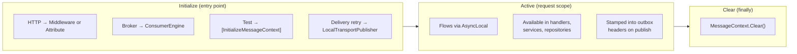
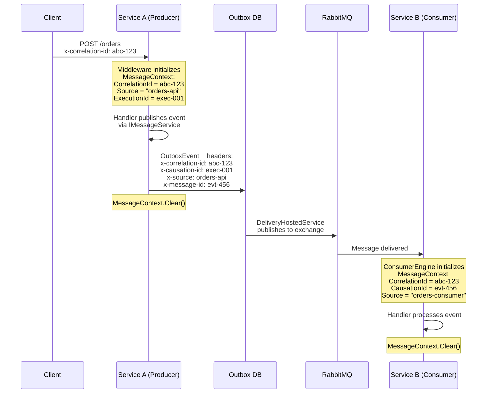
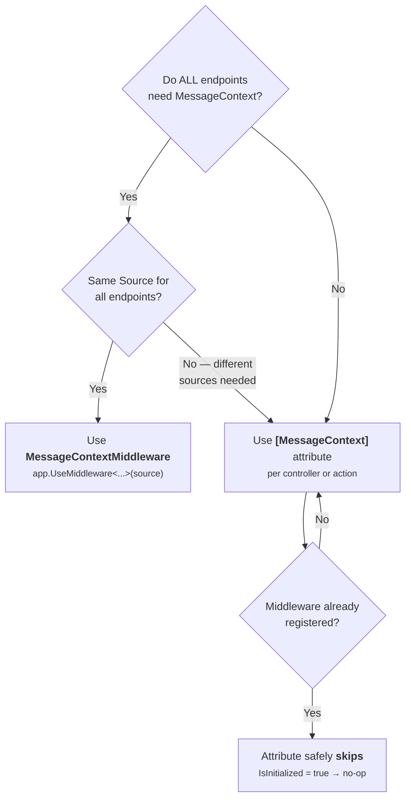
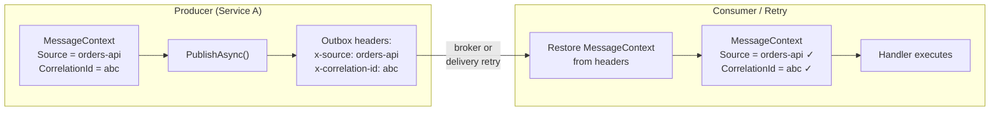
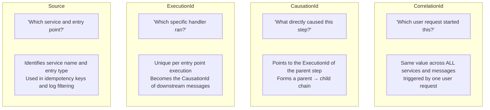
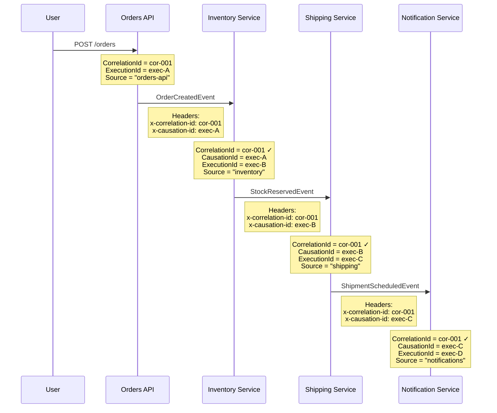
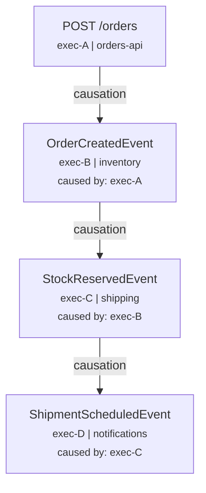

## Overview

`MessageContext` is an `AsyncLocal`-based context that carries correlation, causation, and
source identity across async call chains. Every message produced by the Juice messaging
pipeline stamps the current `MessageContext` values into outbox headers, enabling distributed
tracing and idempotency across service boundaries.

**`MessageContext` must be initialized at every entry point** — HTTP requests, background
consumers, test methods, and hosted services. If not initialized, any code that reads
`MessageContext.Current` will throw `InvalidOperationException`.

---

## Lifecycle



The context is created once per entry point, flows automatically through all `await` calls
(thanks to `AsyncLocal`), and is cleaned up in a `finally` block to prevent leaking into
unrelated work.

---

## MessageContext Fields

| Field | Type | Description |
|---|---|---|
| `CorrelationId` | `string` | Trace ID that spans the entire request chain across services |
| `CausationId` | `string?` | ID of the message that caused this operation (parent event ID) |
| `ExecutionId` | `string` | Unique ID for this specific execution (generated per entry point) |
| `Source` | `string` | Identifies the entry point type (e.g. `"http"`, `"rabbitmq"`, `"xunit.test"`) |

These values are written into outbox event headers and propagated across service boundaries:

| Header | Field |
|---|---|
| `x-correlation-id` | `CorrelationId` |
| `x-causation-id` | `CausationId` |
| `x-source` | `Source` |

### How Headers Propagate Across Services



> **CorrelationId** stays the same across the entire chain — enabling end-to-end tracing.
> **CausationId** links each step to its parent, creating a causal chain.
> **Source** identifies which service/entry point produced each message.

---

## Initialization Methods

There are three ways to initialize `MessageContext`, depending on your entry point:

| Method | Entry point | Package |
|---|---|---|
| `MessageContextMiddleware` | All HTTP requests (global) | `Juice.AspNetCore` |
| `[MessageContext]` attribute | Specific controllers or actions | `Juice.AspNetCore` |
| `[InitializeMessageContext]` attribute | xUnit test methods | `Juice.XUnit` |

Broker consumers (`RabbitMQConsumerEngine`) and local transport (`LocalTransportPublisher`)
initialize `MessageContext` automatically from incoming message headers — no manual setup needed.

---

## MessageContextMiddleware — Global HTTP Initialization

Register the middleware in your ASP.NET Core pipeline to initialize `MessageContext` for
**every HTTP request**. This is the recommended approach for most services.

### NuGet package

| Package | Purpose |
|---|---|
| [Juice.AspNetCore](https://www.nuget.org/packages/Juice.AspNetCore) | `MessageContextMiddleware`, `MessageContextAttribute` |

### Registration

```csharp {linenos=false,hl_lines=[1],linenostart=1}
app.UseMiddleware<MessageContextMiddleware>("my-service");
```

The `source` parameter identifies this service in distributed traces. Choose a meaningful
name — it appears in all outbox headers and idempotency keys produced by this service.

### Behavior

1. Reads `x-correlation-id` from the request header (or generates a new one)
2. Calls `MessageContext.Initialize(correlationId, causationId: null, executionId, source)`
3. Sets `x-correlation-id` on the response header
4. Executes the request pipeline
5. Calls `MessageContext.Clear()` in `finally` (prevents context leak)

### When to use

- You want **all** HTTP endpoints to have `MessageContext` initialized
- Your service has a single logical source name
- This is the simplest and most reliable option for HTTP services

---

## [MessageContext] Attribute — Per-Controller / Per-Action

Use the `[MessageContext]` attribute when you need `MessageContext` on specific controllers
or actions, or when different endpoints need different `Source` values.

### Usage

```csharp {linenos=false,hl_lines=[1,8],linenostart=1}
// All actions in this controller get MessageContext with Source = "orders-api"
[MessageContext(Source = "orders-api")]
[ApiController]
[Route("api/[controller]")]
public class OrdersController : ControllerBase
{
    [HttpPost]
    public async Task<IActionResult> CreateAsync(CreateOrderRequest request)
    {
        // MessageContext.Current is available here
        var correlationId = MessageContext.Current.CorrelationId;
        // ...
    }
}
```

```csharp {linenos=false,hl_lines=[2],linenostart=1}
// Per-action with a specific source
[MessageContext(Source = "webhook-handler")]
[HttpPost("webhook")]
public async Task<IActionResult> HandleWebhookAsync()
{
    // Source = "webhook-handler" for this action only
}
```

### Properties

| Property | Type | Default | Description |
|---|---|---|---|
| `Source` | `string` | `"http"` | Source identifier written into `MessageContext` |

### Behavior

1. Checks `MessageContext.IsInitialized` — if already initialized (e.g. by middleware), **skips** without overwriting
2. Reads `x-correlation-id` from the request header (or generates one)
3. Calls `MessageContext.Initialize(...)` with the configured `Source`
4. Sets `x-correlation-id` on the response header
5. Executes the action
6. Calls `MessageContext.Clear()` in `finally`

### When to use

- You do **not** want global middleware (e.g. some endpoints don't need `MessageContext`)
- Different controllers need different `Source` values
- You want to add `MessageContext` to specific webhook or API endpoints
- You are combining with `MessageContextMiddleware` — the attribute safely no-ops if the middleware already initialized the context

---

## Middleware vs Attribute — Which to Choose



| Scenario | Recommendation |
|---|---|
| All endpoints need `MessageContext`, same source | `MessageContextMiddleware` (global) |
| Only some endpoints need it | `[MessageContext]` attribute on those controllers/actions |
| Different endpoints need different source names | `[MessageContext(Source = "...")]` per controller |
| Middleware is global but one endpoint needs a custom source | Middleware wins (attribute skips if already initialized) — override by removing middleware and using attributes |
| Both middleware and attribute are present | Middleware runs first (it's in the pipeline before MVC filters); attribute detects `IsInitialized` and skips |

---

## [InitializeMessageContext] — xUnit Tests

Use the `[InitializeMessageContext]` attribute on test methods or test classes to
initialize `MessageContext` before the test runs.

### NuGet package

| Package | Purpose |
|---|---|
| [Juice.XUnit](https://www.nuget.org/packages/Juice.XUnit) | `[InitializeMessageContext]`, `[IgnoreOnCIFact]` |

### Usage

```csharp {linenos=false,hl_lines=[1,2],linenostart=1}
[Fact]
[InitializeMessageContext]
public async Task MyTest_Should_Have_MessageContextAsync()
{
    // MessageContext.Current is available
    var correlationId = MessageContext.Current.CorrelationId;
    // ...
}

// Custom values
[Fact]
[InitializeMessageContext(Source = "integration-test", CorrelationId = "test-123")]
public async Task MyTest_With_Custom_SourceAsync()
{
    Assert.Equal("integration-test", MessageContext.Current.Source);
    Assert.Equal("test-123", MessageContext.Current.CorrelationId);
}
```

### Properties

| Property | Type | Default | Description |
|---|---|---|---|
| `CorrelationId` | `string?` | Auto-generated | Custom correlation ID |
| `CausationId` | `string?` | `null` | Custom causation ID |
| `ExecutionId` | `string?` | Auto-generated | Custom execution ID |
| `Source` | `string` | `"xunit.test"` | Source identifier |

### Behavior

- `Before(method)`: Calls `MessageContext.Initialize(...)` with configured or generated values
- `After(method)`: Calls `MessageContext.Clear()`
- Works on both `[Fact]` and `[Theory]` test methods
- Can be applied to a class to cover all test methods

---

## Automatic Initialization — Consumers and Local Transport

These entry points initialize `MessageContext` automatically from message headers — no
manual setup needed:

| Entry point | How it initializes | Source value |
|---|---|---|
| `RabbitMQConsumerEngine` | From incoming message headers (`x-correlation-id`, `x-causation-id`) | Consumer service key |
| `LocalTransportPublisher` | Restored from outbox headers when `MessageContext` is not initialized | `x-source` header value, or `"local"` fallback |



> **Why Source matters for idempotency**: The `"local"` route dispatches immediately via
> the channel AND later via `DeliveryHostedService`. Both paths produce the idempotency
> key `(EventName, "{Source}:{MessageId}")`. Because `LocalTransportPublisher` restores
> `Source` from the `x-source` header, both keys match — preventing duplicate handler
> invocation.

---

## Checking Initialization

Use `MessageContext.IsInitialized` to safely check before accessing `Current`:

```csharp {linenos=false,linenostart=1}
if (MessageContext.IsInitialized)
{
    var source = MessageContext.Current.Source;
    // ...
}
```

This is used internally by `LocalDispatchHelper` to avoid crashes when the
`LocalChannelBackgroundService` processes messages without an HTTP request context.

---

## Distributed Tracing with MessageContext

`MessageContext` gives you three tracing capabilities out of the box — without requiring
OpenTelemetry, Jaeger, or any external tracing infrastructure. Every message that flows
through the Juice pipeline carries these headers, making it possible to reconstruct the
full story of any request across services.

### What each field tells you



### Example: Tracing an Order Across 4 Services

A user places an order. That single request triggers a chain of events across multiple
services. Here is what `MessageContext` captures at each step:



### Querying logs with MessageContext

Every step in the chain shares `CorrelationId = cor-001`. With structured logging, you
can reconstruct the full request flow:

```sql
-- Find everything that happened for this user request
SELECT * FROM logs WHERE correlation_id = 'cor-001' ORDER BY timestamp;
```

```
| timestamp | source       | correlation_id | causation_id | message                        |
|-----------|-------------|----------------|--------------|--------------------------------|
| 10:00:01  | orders-api  | cor-001        | null         | POST /orders received          |
| 10:00:02  | orders-api  | cor-001        | null         | OrderCreatedEvent published    |
| 10:00:03  | inventory   | cor-001        | exec-A       | OrderCreatedEvent handled      |
| 10:00:03  | inventory   | cor-001        | exec-A       | StockReservedEvent published   |
| 10:00:04  | shipping    | cor-001        | exec-B       | StockReservedEvent handled     |
| 10:00:05  | shipping    | cor-001        | exec-B       | ShipmentScheduledEvent published|
| 10:00:06  | notifications| cor-001       | exec-C       | Email sent to customer         |
```

### Building a causation tree

Using `CausationId`, you can reconstruct the exact causal chain — which event triggered
which downstream event:



This tree answers: *"The customer got a shipping notification (exec-D) because shipping
scheduled a shipment (exec-C) because inventory reserved stock (exec-B) because the
user placed an order (exec-A)."*

### Practical uses

| Use case | Which field | How |
|---|---|---|
| **"Show me everything for this request"** | `CorrelationId` | Filter all logs/events by correlation ID |
| **"What caused this failure?"** | `CausationId` | Walk the chain backward: failed step → its causation → parent causation |
| **"Which service produced this event?"** | `Source` | Filter by source to isolate one service's contribution |
| **"Is this a duplicate?"** | `Source` + `MessageId` | Idempotency key `"{Source}:{MessageId}"` prevents double processing |
| **"How long did the full chain take?"** | `CorrelationId` | Compare first and last timestamp with the same correlation ID |
| **"Fan-out: what did this event trigger?"** | `ExecutionId` as parent | Find all messages where `CausationId` = this `ExecutionId` |

### Logging with MessageContext in handlers

Access `MessageContext.Current` in any handler to include tracing fields in your logs:

```csharp {linenos=false,hl_lines=[5,6,7],linenostart=1}
public async Task HandleAsync(OrderCreatedEvent @event)
{
    var ctx = MessageContext.Current;

    _logger.LogInformation(
        "Handling {Event} [correlation={CorrelationId}, causation={CausationId}, source={Source}]",
        nameof(OrderCreatedEvent), ctx.CorrelationId, ctx.CausationId, ctx.Source);

    // ... business logic
}
```

> **Tip**: Use a logging scope or structured logging enricher to automatically include
> `MessageContext` fields in every log entry within the request scope — no manual
> logging of correlation IDs needed.

---

## See also

- [Internal Messaging Setup]() — `MessagingBuilder` and idempotency
- [Consumption Setup]() — RabbitMQ consumer header propagation
- [Local Transport]() — idempotency deduplication via `MessageContext.Source`
